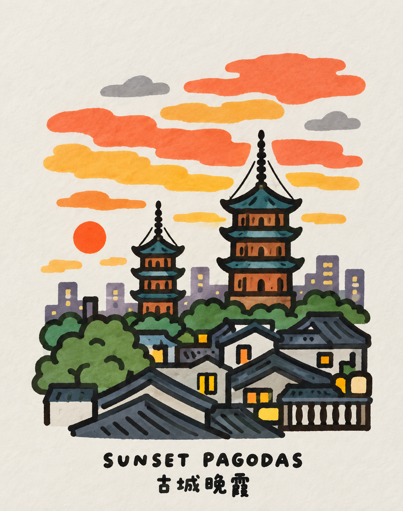
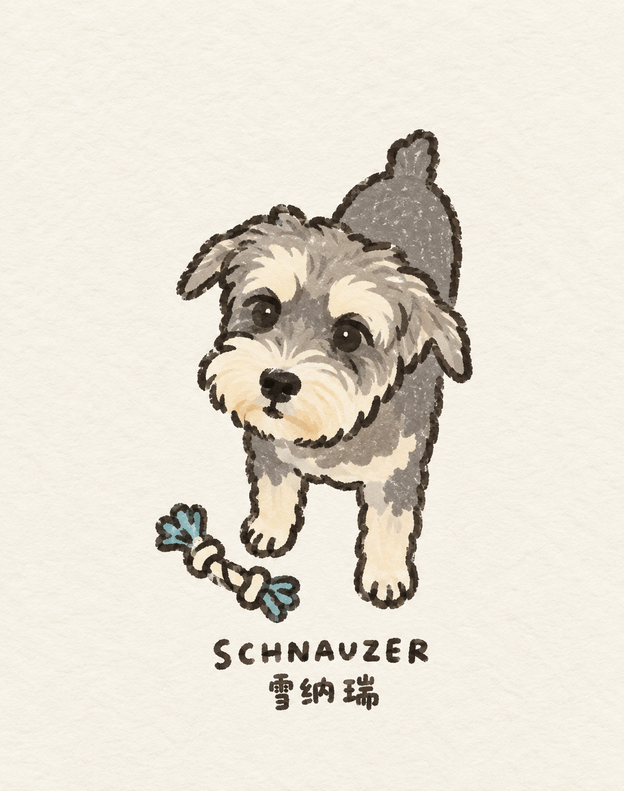
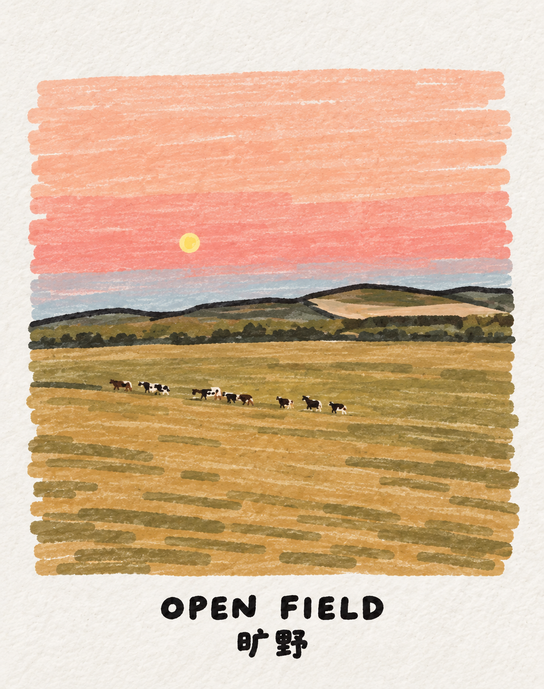

# Hand-Drawn Marker Sticker Skill

一个把照片或主题转成「粗边框手绘贴纸插画」的 Codex Skill。

它的核心不是把照片变成普通卡通，而是做成像旅行手帐、城市贴纸、明信片小插画一样的画面：厚厚的黑色手绘轮廓、干净明亮的色块、温暖纸张颗粒、适度稚拙的造型，以及必要时的手写标题。

## 适合做什么

- 旅行照片、城市建筑、地标、街景
- 宠物、人物、食物、日常小场景
- 小红书/朋友圈配图、手帐贴纸、城市 guide、纪念卡片
- 一组主题图标或一张小型插画卡片

## 风格关键词

- 粗黑色 marker 轮廓，边缘有轻微抖动和手绘感
- 色块干净、明亮、来源于原图，不乱加彩虹色
- 暖白纸张底，四周保留呼吸感和留白
- 复杂细节会被合并成清楚的大形状
- 文字使用厚实、圆润、手写感的标题
- 不追求写实，不追求精确透视，也不做成光滑矢量图

## 效果参考

| 原图 | 使用 Skill 后 |
| --- | --- |
|  |  |
|  |  |
|  |  |

## 使用方式

把这个文件夹放到 Codex Skills 目录后，在对话里可以这样调用：

```text
Use $hand-drawn-marker-sticker to turn this photo into a hand-drawn marker sticker illustration.
```

中文也可以：

```text
用 $hand-drawn-marker-sticker 把这张照片处理成粗边框、暖纸张、干净色块的手绘贴纸风格。
```

如果你希望保留标题，可以直接告诉它标题文字，例如：

```text
用 $hand-drawn-marker-sticker 处理这张图，标题写 SUNSET PAGODAS，下面加中文：古城晚霞。
```

## 设计取向

这个 Skill 特别注意几件事：

1. **不要满版复制照片。** 画面应该像画在纸上的卡片，保留四周留白。
2. **不要把纹理画脏。** 纸张可以有细微颗粒，色块本身尽量干净。
3. **不要乱加颜色。** 鲜亮感来自原图颜色的提炼和对比，而不是额外加很多无关颜色。
4. **复杂图只轻轻简化。** 宠物毛发、建筑窗格、树叶、草地会被合并成大块，但不会被机械地过度 Q 化。
5. **保持原图气质。** 人物、宠物、建筑、风景都应该保留原本的姿态、关系和情绪。

## 文件结构

```text
hand-drawn-marker-sticker-skill/
├── SKILL.md
├── README.md
├── agents/
│   └── openai.yaml
└── examples/
    ├── pagoda-sunset-source.png
    ├── pagoda-sunset-result.png
    ├── schnauzer-source.png
    ├── schnauzer-result.png
    ├── open-field-source.png
    └── open-field-result.png
```

## 说明

示例图片仅用于展示这个 Skill 的视觉效果和适用范围。公开使用时，可以替换成你自己的照片和生成结果。
